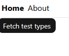
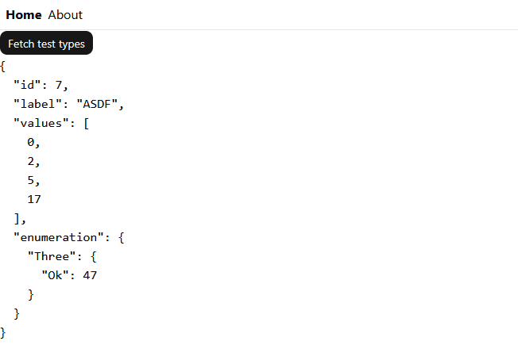

# Promethea

⚠️ This project is currently under heavy construction and will be completely revamped. 

Due to insufficient planning beforehand, the project has been saved under the `pre-alpha` tag and then reset to an empty repository. Until planning is finished, no code will be added here.

## Commit Signing
This project uses signed commits with ssh. To set up:

```bash
# use ssh, not GPG
git config --global gpg.format ssh

# use the public ssh key to sign
git config --global user.signingkey ~/.ssh/id_ed25519.pub

# enable commit signing
git config --global commit.gpgSign true

# create a file, add your email address and the content of your public ssh key
touch ~/.ssh/allowedSignersFile

echo "email@example.com namespaces=\"git\"" <your-public-ssh-key> > ~/.ssh/allowedSignersFile

# tell git to use the file
git config --global gpg.ssh.allowedSignersFile ~/.ssh/allowedSignersFile

# verify it's working, commit something, then run

git verify-commit HEAD

# expected output
$ Good "git" signature for email@example.com with ED25519 key SHA256:<your-ssh-key>
```

## Shared Types
Because the backend and frontend are written in different languages but may need to know about the same types (e.g., backend responds with a `CustomType` to an HTTP GET), shared types are auto-generated using [`ts-rs`](https://github.com/aleph-alpha/ts-rs). To generated the bindings, `ts-rs` generates a Cargo test that generates TypeScript types into [`frontend/packages/lib/src/bindings`](./frontend/packages/lib/src/bindings/) where each type gets written into its own `.ts` file with the same name as the type. Related types are automatically imported too.

Using a type in both frontend and backend works as follows:

1. Define the type somewhere in Rust
```Rust
#[derive(ts_rs::TS, serde::Serialize)]
#[ts(export)]
pub struct MyDummyStruct {
    pub id: u32,
    pub label: String,
    pub values: Vec<usize>,
    pub enumeration: MyDummyEnum,
}

#[derive(ts_rs::TS, serde::Serialize)]
#[ts(export)]
pub enum MyDummyEnum {
    One,
    Two(String),
    Three(Result<u32, String>),
    Four(Option<bool>),
}
```

The type needs to derive `ts_rs::TS` for generating TypeScript bindings, and `serde::Serialize` so they can be used as return types from axum handlers.

2. Use the type in an `axum` handler function

```Rust
async fn return_type() -> Json<MyDummyStruct> {
  let dummy = MyDummyStruct {
      id: 7,
      label: "ASDF".into(),
      values: vec![0, 2, 5, 17],
      enumeration: MyDummyEnum::Three(Ok(47)),
  };
  Json(dummy)
}

#[tokio::main]
async fn main() {
    let app = Router::new().route("/api/test-types", get(return_type));
}
```

3. Generate the corresponding TypeScript bindings
```sh
just test backend
```
The config for `ts-rs` is set so each type is written to its own file in [`./frontend/packages/lib/src/bindings/`](./frontend/packages/lib/src/bindings/), e.g.,

```TypeScript
// frontend/packages/lib/src/bindings/MyDummyEnum.ts
export type MyDummyEnum = "One" | { "Two": string } | { "Three": { Ok : number } | { Err : string } } | { "Four": boolean | null };

```TypeScript
// frontend/packages/lib/src/bindings/MyDummyStruct.ts
import type { MyDummyEnum } from "./MyDummyEnum.ts";

export type MyDummyStruct = { id: number, label: string, values: Array<number>, enumeration: MyDummyEnum, };
```

4. Export the generated types from the package to use them in the frontend application code
```TypeScript
// frontend/packages/lib/src/bindings/index.ts
export * from './MyDummyEnum.js';
export * from './MyDummyStruct.js';
```

5. Import and use the types in the relevant frontend application

```TSX
// frontend/apps/web/src/routes/index.tsx
import { createFileRoute } from "@tanstack/react-router";
import { Button } from "@workspace/ui";
import { useQuery } from "@tanstack/react-query";
import type { MyDummyStruct } from "@workspace/lib";

async fn fetchTestTypes(): Promise<MyDummyStruct> {
  const response = await fetch("/api/test-types");

  if (!response.ok) {
    throw new Error(`Failed to fetch test types: ${response.status}`);
  }

  return response.json() as Promise<MyDummyStruct>;
}

function Index() {
  const query = useQuery({
    queryKey: ["test-types"],
    queryFn: fetchTestTypes,
    enabled: false,
  });

  return (
    <div>
      <Button onClick={() => query.refetch()} disabled={query.isFetching}>
        {query.isFetching ? "Loading..." : "Fetch test types"}
      </Button>

      {query.isError && <div>Error: {query.error.message}</div>}

      {query.data && <pre>{JSON.stringify(query.data, null, 2)}</pre>}
    </div>
  );
} 
```

6. Result:
Before clicking the button:


After clicking the button:


The example explicitly doesn't use TanStack Query's useful automatic fetching by setting `useQuery({..., enabled: false})`. This prevents the query from being executed before the button is clicked. In a real application, that property would be removed to speed up page loads and instead, the visibility of the result would just change upon button click. 
