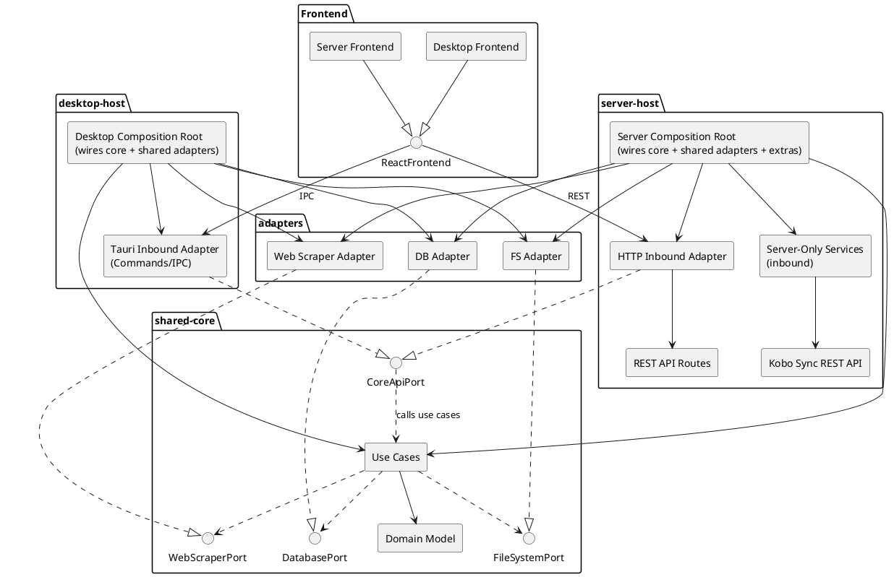

# Hexagonal Architecture

## Status
In progress

## Context

Because the scope of this project is already quite big and will potentially only get bigger, a defined architecture on how to structure the different components is needed. This reduces coupling between components and ensures that the code remains readable and maintainable. 

## Decision

In order to ensure that each component truly stays separate, a hexagonal design is used, where each component handles only one responsibility, and any interaction with that area will only be possible through its component. An orchestrator is responsible for aggregating all components, and both the Tauri framework and a potential future server-only framework will only be thin wrappers around said orchestrator.

## Architecture Overview

Ports are defined as interfaces between the main application and each component. Each component implements its specific interface, thereby providing an adapter that hides business logic behind an API. Currently, there are three components: database access, file system access and metadata scraping. Each component will come with a trait that defines the necessary interface, and a struct for each component will implement the necessary trait. 

In general, interfaces are only to be used when necessary, i.e., only when there are multiple implementations that need to shareable between desktop and server. As such, the adapters will not be associated with an interface for now. Those interfaces are currently not required, and if they at some point become a necessity, adding them will still be a manageable refactor. 

## Consequences

### Positive

- Each component is completely independent and therefore allows testing and modifying without affecting other components.
- If the project ever reaches a state where a server is implemented, only a very thin wrapper will have to be implemented.
- Implementation details are hidden by default.

### Negative

- The architecture is quite complex, and will require a lot of work to set up.
- For an extra HTTP backend, some Tauri features cannot be used out of the box.
- The architecture is an as-of-yet unknown concept; understanding and applying it will take time.
