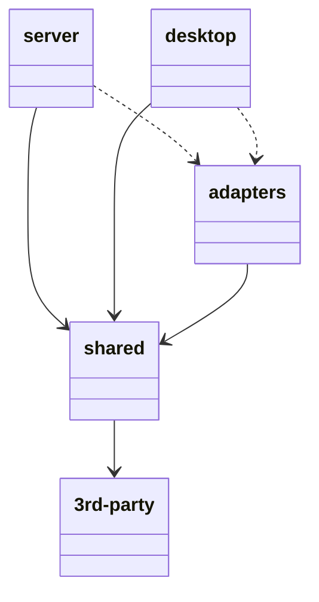

# Promethea Backend

The backend is split into multiple parts, hosting two distinct binaries: [`desktop`](./desktop/) and [`server`](./server). Most shared code lives in [`shared`](./shared), with the exception of [`adapters`](./adapters/), the reason for which is explained below.

## Architecture
Given that most of the application logic is the same regardless of platform, a large part of the code lives in the [`sharead`](./shared) crate. To create a sensible structure, hexagonal architecture is used here. 

In hexagonal architecture, the code is split into ports, adapters and use cases. 

### Ports
A port is a definition for a kind of interface for one specific part of a system. It defines all operations that a distinct part of the system needs to provide. For example, a database port would define operations that communicate with the database (e.g., "fetch all users"). 

Ports are intended to be completely agnostic of 3rd-party crates, platforms etc. They should be a completely abstract definition for how to communicate with part of a system. In general object-oriented programming languages (C++, Python, JS/TS), a port would be an interface or abstract base class. It defines what operations exist, what their arguments are, and what they return. In Rust, this is a trait.

### Adapters
For each port, there is usually one adapter. An adapter is a concrete implementation of a port. In usual object-oriented programming languages, an adapter would be a class that implements such an interface or inherits from an abstract base class. It defines concrete implementations for all the abstract methods defined in the ports. In Rust, this is a struct that implements a trait. 

To avoid both circular dependencies and 3rd-party crate dependencies in the crate that hosts all adapters, the backend workspace has a distinct [`adapters`](./adapters) crate. That way, the dependency flow is clear and will not result in problems:

