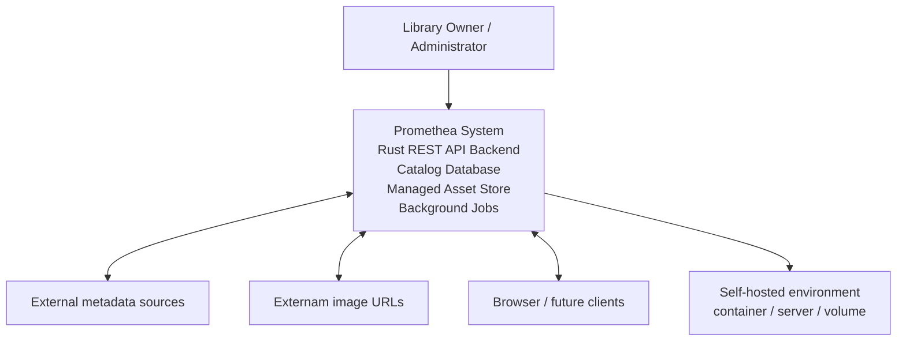

--
date: 2026-06-08
id: VIEW-001-system-context
---

# System Context View

## Viewpoint
Context

## Representation
Promethea is a self-hostable personal library system used by a Library Owner / Administrator, Reader / Authenticated User, Maintainer / Developer, and future Device-Sync User. The system boundary includes the Promethea frontend, backend, catalog persistence, managed assets, background jobs, provider adapters, and administrative/operational features.

Promethea is responsible for library catalog management, EPUB import, metadata extraction and editing, author/series browsing, reading tracking, reading analytics, managed assets, safe EPUB modification, background jobs, and self-hosted operational support.

Promethea is not responsible for public SaaS multi-tenancy, DRM removal, legal validation of user-owned content, full EPUB reading, AI/ML recommendations, or provider-specific metadata contracts beyond the generic provider abstraction. It is _initially_ not responsible for native mobile apps and audiobook playback.

## More Information
Implements or frames: [REQ-INT-001](./../requirements/interface/REQ-INT-001.md), [REQ-INT-003](./../requirements/interface/REQ-INT-003.md), [REQ-INT-004](./../requirements/interface/REQ-INT-004.md), [REQ-INT-005](./../requirements/interface/REQ-INT-005.md), [REQ-INT-006](./../requirements/interface/REQ-INT-006.md), [REQ-INT-008](./../requirements/interface/REQ-INT-008.md), [REQ-DIST-001](./../requirements/distribution/REQ-DIST-001.md), [REQ-COST-001](./../requirements/cost/REQ-COST-001.md), [REQ-COMP-002](./../requirements/compliance/REQ-COMP-002.md)
Related decisions:
Open issues: target deployment model, authentication model, metadata providers, image URL restrictions, and supported operating environments remain TBD.
